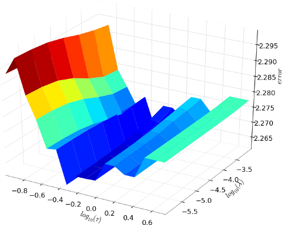

****************
Getting started
****************
Bla bla...

Installation
============
Bla bla...

Tutorial
========
.. currentmodule:: dataset_generation

Using the given script
:download:`dataset_generation.py<tutorial/dataset_generation.py>`
(in the directory :file:`{L1L2PY_SRCDIR}/doc/tutorial`), you can generate
synthetic data for a supervised regression problem.
The script contains a function (called :func:`correlated_dataset`) which
can create a data matrix with some relevant and correlated variables.

Running the script with only two parameters (data matrix dimensions) you
obtain (in the same directory where the script is placed) two text file
called :file:`data.txt` and :file:`labels.txt`

.. code-block:: bash

    $ pwd
    {L1L2PY_SRCDIR}/doc/tutorial
    $ python dataset_generation.py 100 40
    Generation of 100 samples with 40 variables... done
    $ ls
    dataset_generation.py  data.txt  labels.txt

The script creates a random dataset with **3 groups of 5 correlated variables**.
At the end we have **15 relevant variables** and (as in the example above)
*40 - 15* = **25 noisy variables**. The weight assigned to each relevant variable
is 1.0.

You can find the
:download:`data matrix<tutorial/data.txt>` and the
:download:`labels matrix<tutorial/labels.txt>` generated with the script
and used in this tutorial in the the directory
:file:`{L1L2PY_SRCDIR}/doc/tutorial`), where the script itself is placed.

You can copy the two file (or generate different data using the script or
manually the function :func:`correlated_dataset`) and follow the instruction
below.

.. currentmodule:: l1l2py

Preparing data
---------------
First, we have to import the needed packages

>>> import numpy as np
>>> import l1l2py

and load the data from disk

>>> X = np.loadtxt('tutorial/data.txt')
>>> Y = np.loadtxt('tutorial/labels.txt')

Now we have to split data in training and testing set

>>> train_data, test_data = np.vsplit(X, 2)
>>> print train_data.shape, test_data.shape
(50, 40) (50, 40)
>>> train_labels, test_labels = np.hsplit(Y, 2)
>>> print train_labels.shape, test_labels.shape
(50,) (50,)

Setting parameters ranges
-------------------------
At this point we have to set right parameters values.
We can start finding a good range for the sparsity parameter :math:`\tau`
using the function :func:`l1l2py.algorithms.l1_bound`.

>>> train_data_centered = l1l2py.tools.center(train_data)
>>> tau_max = l1l2py.algorithms.l1_bound(train_data_centered, train_labels)
>>> print tau_max
10.5458157567

We can see that using this parameter to solve a *Lasso* optimization problem,
we get a void solution.

>>> beta = l1l2py.algorithms.l1l2_regularization(train_data_centered,
...                                              train_labels, 0.0, tau_max)
>>> print np.allclose(np.zeros_like(beta), beta)
True

Note that we have centered the matrix because we want to use the same
data normalization when we will run the model selection procedure.
Than, we can set extreme values of :math:`\tau` in order to get different level
of sparse solution

>>> tau_max = tau_max - 1e-2
>>> tau_min = tau_max * 1e-2
>>> beta_max = l1l2py.algorithms.l1l2_regularization(train_data_centered,
...                                                  train_labels, 0.0, tau_max)
>>> beta_min = l1l2py.algorithms.l1l2_regularization(train_data_centered,
...                                                  train_labels, 0.0, tau_min)
>>> print len(beta_max.nonzero()[0]), len(beta_min.nonzero()[0])
1 11

The minimum value of :math:`\tau` should be set in order to get a solution with
more non-zero variables than the number of *hypotetical* number of relevant
groups of correlated variables (in the our case we know to have 3 groups).

Than we can set the range of :math:`\tau` values as

>>> tau_range = l1l2py.tools.geometric_range(tau_min, tau_max, 20)

For the regularization parameter :math:`\lambda` we can use a wide range
of values

>>> lambda_range = l1l2py.tools.geometric_range(1e-6, 1e-3, 7)

Instead for the correlation parameter :math:`\mu`, in this simple and
small example we can use a minimum value equal to *0.0* and some different
level of correlation

>>> mu_range = [0.0, 0.001, 0.01, 0.1, 1.0]

Run the model selection
-----------------------
Now we need only to generate (or to write manually) the cross validation splits
to use in the :ref:`stage_i`,

>>> cv_splits = l1l2py.tools.kfold_splits(train_labels, 5) #5-fold CV

and call the our :func:`l1l2py.model_selection` function to get
the results (the complete execution of the function will take some minutes)

>>> out = l1l2py.model_selection(train_data, train_labels,
...                              test_data, test_labels,
...                              mu_range, tau_range, lambda_range,
...                              cv_splits,
...                              cv_error_function=l1l2py.tools.regression_error,
...                              error_function=l1l2py.tools.regression_error,
...                              data_normalizer=l1l2py.tools.center,
...                              labels_normalizer=None)

Analyze the results
-------------------
.. currentmodule:: plot

The optimal value of :math:`\tau` and :math:`\lambda` found in the
:ref:`stage_i` are

>>> print out['tau_opt'], out['lambda_opt']
0.451073293459 0.000316227766017

Using the given module
:download:`plot.py<tutorial/plot.py>`
(in the directory :file:`{L1L2PY_SRCDIR}/doc/tutorial`), you can use
a function (called :func:`kcv_errors`) to plot the mean cross validation
error (remember that for some high value of :math:`\tau`, the solution
could be void on some cross validation split, see :ref:`stage_i`)

>>> from plot import kcv_errors
>>> tau_max_idx = out['kcv_err_ts'].shape[0]
>>> kcv_errors(out['kcv_err_ts'],
...            np.log10(tau_range[:tau_max_idx]), np.log10(lambda_range),
...            r'$log_{10}(\tau)$', r'$log_{10}(\lambda)$')
>>> plt.show()

.. image:: _static/tutorial_kcv_err.png

Because the error increase rapidly with the highest value of :math:`\tau`,
is useful to show the error surface removing the last row from the mean errors
matrix

>>> tau_max_idx -= 1
>>> kcv_errors(out['kcv_err_ts'][:tau_max_idx,:],
...            np.log10(tau_range[:tau_max_idx]), np.log10(lambda_range),
...            r'$log_{10}(\tau)$', r'$log_{10}(\lambda)$')
>>> plt.show()

Than, we can also print the indexes of the (almost) nested list of relevant
variables watching the ``selected_list`` entry of the resulting :class:`dict`
object.

>>> for mu, sel in zip(mu_range, out['selected_list']):
...     print "%.3f:" % mu, sel.nonzero()[0]
0.000: [ 3  4  5 10 12 14]
0.001: [ 1  2  3  4  5  6  7  8  9 10 11 12 13 14]
0.010: [ 0  1  2  3  4  5  6  7  8  9 10 11 12 13 14]
0.100: [ 0  1  2  3  4  5  6  7  8  9 10 11 12 13 14]
1.000: [ 0  1  2  3  4  5  6  7  8  9 10 11 12 13 14 15 22 24 29 32 35 38 39]

Analyzing the result, we can see that the minimal list contains two variables
belonging to the first group (indexes *3* and *4*), one variable belonging to the
second group (index *5*) and three variables belonging to the
third group (indexes *10, 12* and *14*), without any noisy variables!
Incrementing the correlation parameter we could include all the relevant
variables obtaining model with (almost) constant prediction power.

Indeed, watching the testing error of the *RLS* solution calculated with the
selected variables (and the optimal :math:`\lambda`) we have the following
result

>>> for mu, err in zip(mu_range, out['err_ts_list']):
...     print "%.3f: %.3f" % (mu, err)
0.000: 2.131
0.001: 2.236
0.010: 2.224
0.100: 2.224
1.000: 2.227

Appendix: functions used in this tutorial
-----------------------------------------
.. currentmodule:: dataset_generation

.. testsetup:: *

   from dataset_generation import correlated_dataset

.. autofunction:: correlated_dataset

.. currentmodule:: plot

.. testsetup:: *

   import numpy
   from matplotlib import pyplot as plt

.. autofunction:: kcv_errors