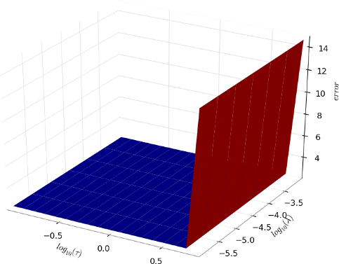

****************
Getting started
****************
L1L2Py is a simple and lightweight python package to perform variable selection.
The algoritms proposed and implemented are been well studied in different
experimental settings.

The package is self contained and gives all the needed tools to generate
sparse solution for a given linear classification or regression problem.

Installation
============
L1L2Py is available open-source under the
`GNU GPL <http://www.gnu.org/licenses/gpl.html>`_ license.
It requires `Python <http://www.python.org>`_ version 2.5 or higher and the
`NumPy <http://numpy.scipy.org>`_ package.

There are two ways you can get it:

* **Automatic Installation (recomended)**

  L1L2Py is available on the
  `Python Package Index <http://pypi.python.org/pypi/L1L2Py>`_ and can be
  installed via
  `easy-install <http://peak.telecommunity.com/DevCenter/EasyInstall>`_

  .. code-block:: bash

      $ easy_install -U L1L2Py

  or `pip <http://www.pip-installer.org/>`_
  
  .. code-block:: bash

      $ pip install -U L1L2Py

* **Manual Installation**

  Download the latest official version
  `L1L2Py-1.0.5.tar.gz <http://slipguru.disi.unige.it/Software/L1L2Py/L1L2Py-1.0.5.tar.gz>`_,
  then:

  .. code-block:: bash

      $ tar xzvf L1L2Py-1.0.5.tar.gz
      $ cd L1L2Py-1.0.5
      $ python setup.py install

  Using this manual installation, if the testing framework
  `Nose <http://somethingaboutorange.com/mrl/projects/nose>`_ is installed,
  is possible to run the given
  `Unit Test <http://en.wikipedia.org/wiki/Unit_testing>`_ running the
  ``nosetests`` script

  .. literalinclude:: tests.txt
     :language: bash

Moreover, in order to generate the plots showed in the following
tutorial the `Matplotlib <http://matplotlib.sourceforge.net/>`_ package
(with the `mplot3d toolkit <http://matplotlib.sourceforge.net/mpl_toolkits/mplot3d>`_
enabled) is required.

Tutorial
========

This tutorial aims to show how the :math:`\ell_1\ell_2` regularization with
double optimization is able to perform variable selection. Moreover, the
tutorial shows how to use L1L2Py on a synthetic dataset generated with a given
function which simulates a linear regression problem with a subset of relevant
and linearly correlated variables.

Even if it's not mandatory, in order to better understand this tutorial the
reader should read the method described in [DeMol09b]_, or at least
the introduction of :ref:`core`.

Synthetic Data Generation
-------------------------
.. currentmodule:: dataset_generation

Using the script
:download:`dataset_generation.py<tutorial/dataset_generation.py>`
(:file:`L1L2Py-1.0.5/docs/tutorial/dataset_generation.py`),
synthetic data can be generated for a supervised regression problem.
The script contains a function (called :func:`correlated_dataset`) which
generates a data matrix with some relevant, correlated and noisy variables.

Running the script with only two parameters (i.e. the data matrix dimensions)
two text files, namely :file:`data.txt` and :file:`labels.txt` are generated
in the same directory containing the script file.

.. code-block:: bash

    $ python dataset_generation.py 100 40
    Generation of 100 samples with 40 variables... done
    $ ls
    dataset_generation.py  data.txt  labels.txt

The script generates a random dataset with **3 groups of 5 correlated variables**.
In total, there are **15 relevant variables** and, following the example above,
*40 - 15* = **25 noisy variables**.
The weight assigned to each relevant variable is `1.0`.

The
:download:`data matrix<tutorial/data.txt>` and the
:download:`labels matrix<tutorial/labels.txt>` generated with the script
and used in this tutorial can be found in the the directory
:file:`L1L2py-1.0.5/docs/tutorial`), where the script itself is located.

To familiarize with the ``l1l2py`` code, the two files can be copied where
needed and used following the tutorial steps below (alternatively, different
datasets can be generated using either the script or the function
:func:`correlated_dataset`).

.. currentmodule:: l1l2py

Preparing the data
------------------
First, starting a new python terminal, import the needed packages:

>>> import numpy as np
>>> import l1l2py

and load the data from disk (change file paths as needed):

>>> X = np.loadtxt('tutorial/data.txt')
>>> Y = np.loadtxt('tutorial/labels.txt')

Then, split the data in two blocks, training-set and test-set using the standard
NumPy functions :func:`numpy.vsplit` and :func:`numpy.hsplit`

>>> train_data, test_data = np.vsplit(X, 2)
>>> print train_data.shape, test_data.shape
(50, 40) (50, 40)
>>> train_labels, test_labels = np.hsplit(Y, 2)
>>> print train_labels.shape, test_labels.shape
(50,) (50,)

as shown, each set contains `50` samples.

Setting parameters ranges
-------------------------
At this point a correct range for the regularization parameters has to be chosen.
The function :func:`l1l2py.algorithms.l1_bound` can be used to devise an optimal
range for the sparsity parameter :math:`\tau`.

>>> train_data_centered = l1l2py.tools.center(train_data)
>>> tau_max = l1l2py.algorithms.l1_bound(train_data_centered, train_labels)
>>> print tau_max
10.5458157567

Note that the matrix is centered, because the same normalization will be used
when running the model selection procedure (see later).

Using this parameter to solve a *Lasso* optimization problem, a void solution
would be obtained:

>>> beta = l1l2py.algorithms.l1l2_regularization(train_data_centered,
...                                              train_labels, 0.0, tau_max)
>>> print np.allclose(np.zeros_like(beta), beta)
True

A good choice for the extreme values for :math:`\tau` could be

>>> tau_max = tau_max - 1e-2
>>> tau_min = tau_max * 1e-2
>>> beta_max = l1l2py.algorithms.l1l2_regularization(train_data_centered,
...                                                  train_labels, 0.0, tau_max)
>>> beta_min = l1l2py.algorithms.l1l2_regularization(train_data_centered,
...                                                  train_labels, 0.0, tau_min)
>>> print len(beta_max.nonzero()[0]), len(beta_min.nonzero()[0])
1 10

The minimum value of :math:`\tau` should be set in order to get a solution with
more non-zero variables than the number of *hypotetical* number of relevant
groups of correlated variables (in the our case we know to have `3` groups).

The range of :math:`\tau` values can therefore be set as:

>>> tau_range = l1l2py.tools.geometric_range(tau_min, tau_max, 20)

For the regularization parameter :math:`\lambda` a wide range
of values is advisable

>>> lambda_range = l1l2py.tools.geometric_range(1e-6, 1e-3, 7)

as for the correlation parameter :math:`\mu`. For this simple example some
different levels of correlation are set, starting from `0.0`

>>> mu_range = [0.0, 0.001, 0.01, 0.1, 1.0]

Run the model selection
-----------------------
To correctly use the :ref:`stage_i`, cross validation splits must be generated:

>>> cv_splits = l1l2py.tools.kfold_splits(train_labels, k=5) #5-fold CV

Now, call the :func:`l1l2py.model_selection` function to get
the results of model selection (the complete execution of the function
will take some minutes)

>>> out = l1l2py.model_selection(train_data, train_labels,
...                              test_data, test_labels,
...                              mu_range, tau_range, lambda_range,
...                              cv_splits,
...                              cv_error_function=l1l2py.tools.regression_error,
...                              error_function=l1l2py.tools.regression_error,
...                              data_normalizer=l1l2py.tools.center,
...                              labels_normalizer=None)

Analyze the results
-------------------
.. currentmodule:: plot

The optimal value of :math:`\tau` and :math:`\lambda` found in the
:ref:`stage_i` are:

>>> print out['tau_opt'], out['lambda_opt']
0.451073293459 0.000316227766017

The module :download:`plot.py<tutorial/plot.py>`
(:file:`L1L2py-1.0.5/docs/tutorial/plot.py`), provides
a function (called :func:`kcv_errors`) to plot the mean cross validation
error (remember that for some high values of :math:`\tau`, the solution
could be void on some cross validation splits, see :ref:`stage_i`, so the
mean could be evaluated on a subset of (:math:`\tau`, :math:`\lambda`) pairs)

>>> from matplotlib import pyplot as plt
>>> from plot import kcv_errors
>>> tau_max_idx = out['kcv_err_ts'].shape[0]
>>> kcv_errors(out['kcv_err_ts'],
...            np.log10(tau_range[:tau_max_idx]), np.log10(lambda_range),
...            r'$log_{10}(\tau)$', r'$log_{10}(\lambda)$')
>>> plt.show()

Since the error increases rapidly with the highest value of :math:`\tau`,
is useful to show the error surface removing the (corresponding) last row
from the mean errors matrix

>>> tau_max_idx -= 1
>>> kcv_errors(out['kcv_err_ts'][:tau_max_idx,:],
...            np.log10(tau_range[:tau_max_idx]), np.log10(lambda_range),
...            r'$log_{10}(\tau)$', r'$log_{10}(\lambda)$')
>>> plt.show()

.. image:: _static/tutorial_kcv_err_zoom.png

The (almost completely) nested list of relevant variables
is stored in the ``selected_list`` entry of the resulting :class:`dict`
object:

>>> for mu, sel in zip(mu_range, out['selected_list']):
...     print "%.3f:" % mu, sel.nonzero()[0]
0.000: [ 3  4  5 10 12 14]
0.001: [ 1  2  3  4  5  6  7  8  9 10 11 12 13 14]
0.010: [ 0  1  2  3  4  5  6  7  8  9 10 11 12 13 14]
0.100: [ 0  1  2  3  4  5  6  7  8  9 10 11 12 13 14]
1.000: [ 0  1  2  3  4  5  6  7  8  9 10 11 12 13 14 15 22 24 29 32 35 38 39]

Remembering that in the used dataset we have `3` groups of `5` relevant
variables, with indexes from `0` to `14`, the result shows that the minimal
list contains two variables belonging to the first group (indexes `3` and `4`),
one variable belonging to the second group (index `5`) and three variables
belonging to the third group (indexes `10, 12` and `14`), without any noisy
variables!
Incrementing the correlation parameter all the relevant
variables can be included obtaining a model with (almost) constant prediction
power.

In fact, the test error evaluated by the *RLS* solution computed on the
selected variables (with the optimal value of :math:`\lambda`) is:

>>> for mu, err in zip(mu_range, out['err_ts_list']):
...     print "%.3f: %.3f" % (mu, err)
0.000: 2.131
0.001: 2.236
0.010: 2.224
0.100: 2.224
1.000: 2.227

Appendix: functions used in this tutorial
-----------------------------------------
.. currentmodule:: plot

.. testsetup:: *

   import numpy
   from matplotlib import pyplot as plt

.. autofunction:: kcv_errors

.. currentmodule:: dataset_generation

.. testsetup:: *

   from dataset_generation import correlated_dataset

.. autofunction:: correlated_dataset
